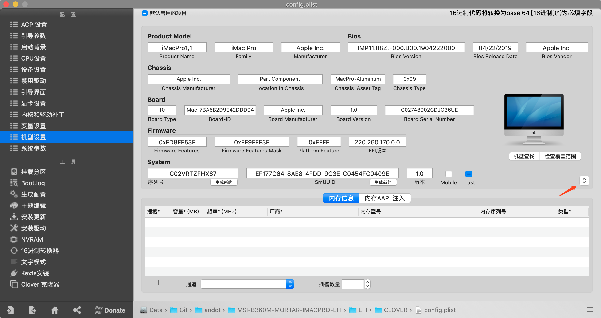

# 微星 B360M 迫击炮 + AMD 独显黑苹果 EFI

## 我的配置

|         硬件       |                   型号                  | 
|-------------------:|:----------------------------------------|
|               主板 | 微星 B360M 迫击炮                       |
|                CPU | Intel Core i7-8700                      |
|               显卡 | 蓝宝石 RX580 8G 2304SP 白金版 1366MHz   |
|              硬盘1 | 三星 970 Pro 1T M2 NVMe                 |
|              硬盘2 | 三星 SM961 512G M2 NVMe                 |
|              硬盘3 | 东芝 TR200 960G SSD SATA                |
|               内存 | 英睿达镁光 DDR4 2666Mhz 16G*2 (共 32G)  |
|        无线 + 蓝牙 | BCM943602CS 双频 BT4.1 无线网卡 PCI-E   |
|    摄像头 + 麦克风 | 蓝色妖姬 480p USB2 摄像头带内置麦克风   |
| 机箱 + 电源 + 风扇 | 酷冷至尊Q300L机箱，MWE500电源，风扇 * 3 |
|               键盘 | 罗技 K780                               |
|               鼠标 | 罗技 M590                               |
|      USB3.1 Type-C | Type-E 转为 Type-C 的 USB 3.1 的挡板线  |
|            显示器1 | 43寸 4K 飞利浦显示器 BDM4350UC          |
|            显示器2 | 23寸 1080p AOC 显示器 2367              |
|             读卡器 | 绿联 USB 3.0 四合一读卡器               |

## 兼容本 EFI 的设备

|         硬件       |                              型号                           | 
|-------------------:|:------------------------------------------------------------|
|               主板 | 微星 B360M 迫击炮（钛金版）                                 |
|                CPU | Intel 8代、9代酷睿处理器，有无核显都可以                    |
|               显卡 | RX560、RX570、RX580、RX590、Vega56、Vega64、Radeon VII      |
|               硬盘 | 除了几个特别，比如 PM981、970 Evo Plus 等，其它的应该都可以 |
|               内存 | 其它的没试过，反正镁光的没问题                              |
|        无线 + 蓝牙 | 淘宝上很多苹果免驱的无线 + 蓝牙的 PCI-E 卡都可以            |
|    摄像头 + 麦克风 | 只要是苹果上免驱的都可以                                    |
| 机箱 + 电源 + 风扇 | 根据你的爱好和CPU、显卡的功率来决定                         |
|        键盘 + 鼠标 | 根据个人爱好任意选择                                        |
|             显示器 | 根据个人爱好任意选择                                        |
|             读卡器 | 只要是苹果上免驱的都可以                                    |
|           其它外设 | 根据个人爱好随意选配                                        |

## 显卡选择注意事项

因为微星 B360M 迫击炮主板的第 4 个 PCI-E 插槽跟第 2 个 M2 槽冲突，所以如果像我一样选择双 M2 硬盘的话，那么在选择显卡的时候一定要注意不要选择超过两个 PCI-E 插槽厚度的显卡，否则第 3 个 PCI-E 插槽（PCI-E x1）会被显卡挡住不能用，这样就无法插苹果免驱的无线 + 蓝牙网卡了。

我测试过可以正常使用的显卡有：

* 蓝宝石 RX580 8G 2304SP 白金版 1366MHz (厚度为 42mm)
* 迪兰（Dataland）RX VEGA56 8G X-Serial 战神（厚度为 40mm）

厚度小于等于 42mm 的显卡应该都不妨碍第三个 PCI-E 插槽。

对于 44mm 的显卡，比如：

* 蓝宝石 RX580 8G 2304SP 超白金极光
* 蓝宝石 RX590 8G 超白金

跟无线网卡一起插入可能有一定的冲突，但如果无线网卡比较薄，或自己想办法打磨一下，机箱又采用横放的话，也许可以避免显卡风扇刮到无线网卡，但我个人不建议冒这个风险。

个人建议，如果有钱就上 Radeon VII，这个显卡厚度上是 40mm，是没有问题的。

## 更新日志

### 2019年8月21日

经过一个多月的使用测试后，首次发布。

这个 EFI 的特点是使用的是 `iMacPro1,1` 机型，只是用独显硬解，因此 CPU 有无核显都可以正常工作，且比使用核显硬解更正常。已做了 USB 定制，所有 USB 接口都可用，睡眠正常，唤醒正常。

Clover 版本为：5045。

Clover 驱动包含：

* ApfsDriverLoader.efi
* EmuVariableUefi.efi
* FSInject.efi
* HFSPlus.efi
* OsxAptioFix2Drv-free2000.efi
* VirtualSmc.efi

系统驱动包含：

* AppleALC.kext - 1.4.0
* IntelMausi.kext - 1.0.1
* Lilu.kext - 1.3.8
* USBInjectAll.kext - 0.7.1
* VirtualSMC.kext - 1.0.7
* WhateverGreen.kext - 1.3.2
* XHCI-unsupported.kext - 0.9.2

下面这几个是 VirtualSMC 的插件

* SMCBatteryManager.kext
* SMCLightSensor.kext
* SMCProcessor.kext
* SMCSuperIO.kext

其中
* SMCBatteryManager.kext
* SMCLightSensor.kext

这两个插件对台式机是没有什么用的，可以删掉。我这里保留它们是因为这个版本的 VirtualSMC 1.0.7 并不是官方编译的版本，而是 PCbeta 上的网友 Dynamix 自编译的版本。因为官方版本会导致系统无法正常启动，而这个自编译版本可以正常启动，为了保持这个自编译版本驱动的完整性，因此这里都做了保留。

## EFI 使用

如果你的配置跟我上面配置相同或兼容，那么你可以直接使用该 EFI 进行安装。安装前请注意，一定要用 Clover Configurator 重新生成并替换 SMBIOS 部分的内容，否则会因为机器有同一个硬件 ID 而被苹果封锁。生成时，请选择 iMacPro1,1 机型，不要更改机型。

## 系统截图

