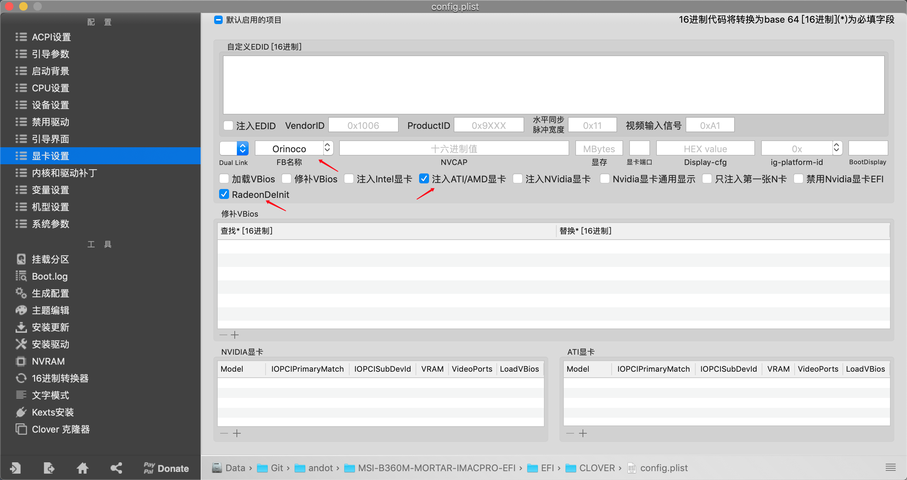

# 微星 B360M 迫击炮 + AMD 独显黑苹果 - Clover 引导 EFI 

## 我的配置

|               硬件 | 型号                                                        |
| -----------------: | :---------------------------------------------------------- |
|               主板 | MSI® B360M MORTAR                                           |
|                CPU | 英特尔® 酷睿™ i5-9400 处理器 2.9GHz                         |
|               显卡 | 蓝宝石® RX590 8G D5 超白金 极光特别版                       |
|              硬盘1 | 英特尔® 固态盘 760p 系列 512GB                              |
|              硬盘2 | 西部数据® 蓝盘 1TB                                          |
|               内存 | 海盗船 复仇者® LPX 2666MHz 8GB x 2                          |
|        无线 + 蓝牙 | 博通® BCM94360CD                                            |
| 机箱 + 电源 + 风扇 | 追风者® MG NEO Micro 410，振华® 冰山金蝶550战斗版，风扇 * 3 |
|               键盘 | IKBC® C87                                                   |
|               鼠标 | 罗技® MX Master 2S                                          |
|             显示器 | 宏碁® XV272U P 27英寸 2K 144Hz HDR400 IPS                   |


## 更新日志

### 2019年12月19日

在 BIOS 中关闭了 `CFG Lock`，因此将 `AppleIntelCPUPM` 和 `内核电源` 两个选项的取消勾选。


从源库更新了 Clover 和一些驱动。

### 2019年12月19日

在 BIOS 中关闭了 `CFG Lock`，因此将 `AppleIntelCPUPM` 和 `内核电源` 两个选项的取消勾选。

### 2019年12月18日

*forked from andot*

- 更改 机型为 `iMac19,2`。
- 根据微星 B360M 迫击炮主板和追风者 MG NEO 410 机箱定制 USB 驱动——
  - 禁用 USB 端口限制补丁
  - 删除 原 EFI 中的 `USBInjectAll.kext`
  - 加入 `EFI/CLOVER/ACPI/patched/SSDT-EC.aml` 和 `EFI/CLOVER/kexts/Other/USBPorts.kext`

### 2020年1月9日

更新 Clover 版本到 5103。
更新了一些驱动。

### 2019年12月14日

加入 NightShiftUnlocker.kext。
更新 WhateverGreen.kext 到 1.3.6。

### 2019年12月6日

更新 Clover 版本到 5100。
加入 slide 启动项，修正有时无法启动的问题。
自动开启 TRIM 支持。

### 2019年12月6日

更新驱动到最新版本。更新 Clover 版本到 5099。

### 2019年11月1日

更新驱动到最新版本。可以正常升级到 macOS Catalina 10.15.1。

### 2019年10月9日

更新 Clover 版本到 5070。可以正常升级到 macOS Catalina。

### 2019年8月27日

更新 Clover 版本到 5058。

### 2019年8月22日

更新 Clover 版本到 5051。

### 2019年8月21日

经过一个多月的使用测试后，首次发布。

<<<<<<< HEAD
## Geekbench 4 跑分
=======
## EFI 简介

这个 EFI 的特点是使用的是 `iMacPro1,1` 机型，用独显硬解，因此 CPU 有无核显都可以正常工作，且比使用核显硬解更正常。已做了 USB 定制，所有 USB 接口都可用，睡眠正常，唤醒正常。

Clover 版本为：5100。

Clover 驱动包含：

* ApfsDriverLoader.efi
* AptioMemoryFix.efi
* EmuVariableUefi.efi
* FSInject.efi
* HFSPlus.efi
* VirtualSmc.efi

系统驱动包含：

* AppleALC.kext - 1.4.5
* IntelMausi.kext - 1.0.2
* Lilu.kext - 1.4.1
* USBInjectAll.kext - 0.7.4
* VirtualSMC.kext - 1.0.9
* WhateverGreen.kext - 1.3.6
* NightShiftUnlocker.kext - 2.2.1

下面这 2 个是 VirtualSMC 的插件

* SMCProcessor.kext
* SMCSuperIO.kext

## EFI 使用

如果你的配置跟我上面配置相同或兼容，那么你可以直接使用该 EFI 进行安装。安装前请注意，一定要用 Clover Configurator 重新生成并替换 SMBIOS 部分的内容，否则会因为机器有同一个硬件 ID 而被苹果封锁。生成时，请选择 `iMacPro1,1` 机型，不要更改机型，如果你的 CPU 有核显，并且核显已经再 BIOS 中打开，也可以选择 `iMac19,2` 机型，这种情况下，核显可以和独显一起工作。


如果你的显卡跟我一样是 RX 580 8G 2304sp 的话，建议把显卡设置页面设置为下图这样：



你会发现显卡功耗会降低 20w 左右。

## 小技巧

### 开启原生电源管理

如果你在 BIOS 里面把 `CFG Lock` 选项设置为 `Disable`，那么你还可以用 Clover Configurator 修改配置文件，将 `AppleIntelCPUPM` 和 `内核电源` 两个选项的对勾去掉，这样就可以开启原生电源管理了，据说性能会有微小的一点提升。

### 跟 Windows 和 BIOS 中的时间同步

```
sudo sh -c "$(curl -fsSL https://raw.githubusercontent.com/xiaoMGithub/LocalTime-Toggle/master/fix_time_osx.sh)"
```

## Geekbench 跑分

* CPU (单核：6079，多核：28401)：https://browser.geekbench.com/v4/cpu/14377865
* Metal (131638)：https://browser.geekbench.com/v4/compute/4463241
* OpenCL (133320): https://browser.geekbench.com/v4/compute/4463244


## 系统截图
>>>>>>> upstream/master

* CPU (单核：5259，多核：21292)：https://browser.geekbench.com/v4/cpu/15048380
* OpenCL (150951): https://browser.geekbench.com/v4/compute/4671536
