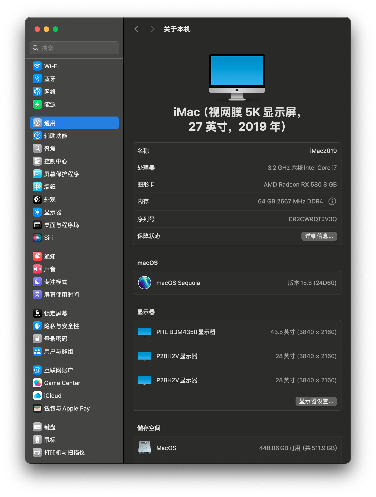
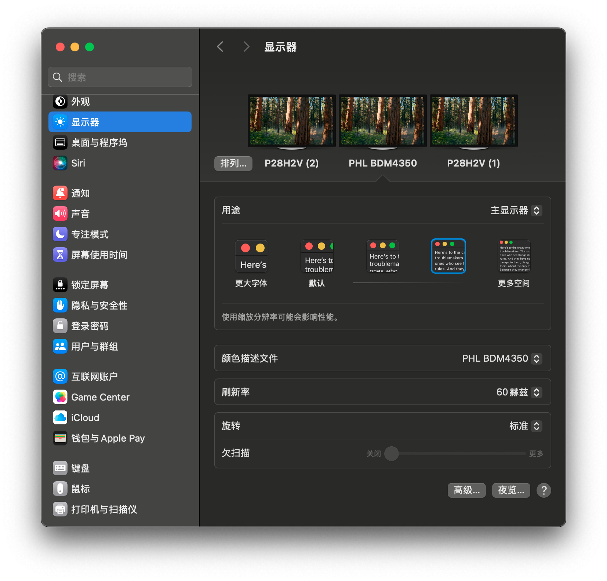
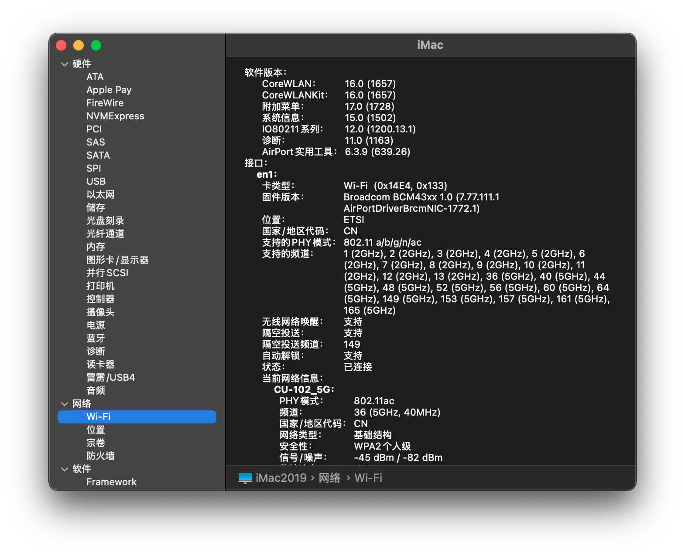

# 微星 B360M 迫击炮 + AMD 独显黑苹果 EFI

## 我的配置

|               硬件 | 型号                                    |
|-------------------:|:----------------------------------------|
|               主板 | 微星 B360M 迫击炮                       |
|                CPU | Intel Core i7-8700                      |
|               显卡 | 蓝宝石 RX580 8G 2304SP 白金版 1366MHz   |
|              硬盘1 | 三星 970 Pro 1T M2 NVMe                 |
|              硬盘2 | 三星 SM961 512G M2 NVMe                 |
|              硬盘3 | 东芝 TR200 960G SSD SATA                |
|               内存 | 英睿达镁光 DDR4 2666Mhz 16G*2 (共 32G)  |
|        无线 + 蓝牙 | BCM943602CS 双频 BT4.1 无线网卡 PCI-E   |
|    摄像头 + 麦克风 | 蓝色妖姬 480p USB2 摄像头带内置麦克风   |
| 机箱 + 电源 + 风扇 | 酷冷至尊Q300L机箱，MWE500电源，风扇 * 3 |
|               键盘 | 罗技 K780                               |
|               鼠标 | 罗技 M590                               |
|      USB3.1 Type-C | Type-E 转为 Type-C 的 USB 3.1 的挡板线  |
|            显示器1 | 43寸 4K 飞利浦显示器 BDM4350UC          |
|            显示器2 | 23寸 1080p AOC 显示器 2367              |
|             读卡器 | 绿联 USB 3.0 四合一读卡器               |

## 兼容本 EFI 的设备

|               硬件 | 型号                                                        |
|-------------------:|:------------------------------------------------------------|
|               主板 | 微星 B360M 迫击炮（钛金版）                                 |
|                CPU | Intel 8代、9代酷睿处理器，有无核显都可以                    |
|               显卡 | RX560、RX570、RX580、RX590、Vega56、Vega64、Radeon VII      |
|               硬盘 | 除了几个特别，比如 PM981、970 Evo Plus 等，其它的应该都可以 |
|               内存 | 其它的没试过，反正镁光的没问题                              |
|        无线 + 蓝牙 | 淘宝上很多苹果免驱的无线 + 蓝牙的 PCI-E 卡都可以            |
|    摄像头 + 麦克风 | 只要是苹果上免驱的都可以                                    |
| 机箱 + 电源 + 风扇 | 根据你的爱好和CPU、显卡的功率来决定                         |
|        键盘 + 鼠标 | 根据个人爱好任意选择                                        |
|             显示器 | 根据个人爱好任意选择                                        |
|             读卡器 | 只要是苹果上免驱的都可以                                    |
|           其它外设 | 根据个人爱好随意选配                                        |

## 显卡选择注意事项

因为微星 B360M 迫击炮主板的第 4 个 PCI-E 插槽跟第 2 个 M2 槽冲突，所以如果像我一样选择双 M2 硬盘的话，那么在选择显卡的时候一定要注意不要选择超过两个 PCI-E 插槽厚度的显卡，否则第 3 个 PCI-E 插槽（PCI-E x1）会被显卡挡住不能用，这样就无法插苹果免驱的无线 + 蓝牙网卡了。

我测试过可以正常使用的显卡有：

* 蓝宝石 RX580 8G 2304SP 白金版 1366MHz (厚度为 42mm)
* 迪兰（Dataland）RX VEGA56 8G X-Serial 战神（厚度为 40mm）

厚度小于等于 42mm 的显卡应该都不妨碍第三个 PCI-E 插槽。

对于 44mm 的显卡，比如：

* 蓝宝石 RX580 8G 2304SP 超白金极光
* 蓝宝石 RX590 8G 超白金

跟无线网卡一起插入可能有一定的冲突，但如果无线网卡比较薄，或自己想办法打磨一下，机箱又采用横放的话，也许可以避免显卡风扇刮到无线网卡，但我个人不建议冒这个风险。

个人建议，如果有钱就上 Radeon VII，这个显卡厚度上是 40mm，是没有问题的。

## 更新日志

### 2021年6月22日

* 删除 OC。
* 更新 Clover 到 5137 版本。
* 驱动更新为最新版本。
* 支持 Big Sur 升级到 11.4。

### 2021年1月10日

* 更新 OC 到 0.6.5 版本。
* 更新 Clover 到 5128 版本。
* 驱动更新为最新版本。
* Clover 已经可以启动 Big Sur（需要从 Preboot 分区启动），为了让多系统引导时，其它系统保持原汁原味，默认启动改为 Clover。

### 2020年12月13日

* 更新 OC 到 0.6.4 版本。
* 驱动更新为最新版本。
* 更新了一下 OC 的配置文件，方便关闭 SIP。

### 2020年11月4日

* 更新 OC 到 0.6.3 版本。
* 驱动更新为最新版本。

### 2020年7月4日

* 更新 Clover 版本到 5119。
* 默认改为 OC 0.6.0 启动（修改自：[MSI-B360M-MORTAR-HACKINTOSH-OPENCORE-EFI](https://github.com/GeQ1an/MSI-B360M-MORTAR-HACKINTOSH-OPENCORE-EFI)）。
* OC 下 Lilu 更新到 1.4.5。
* OC 下 WhateverGreen 更新到 1.4.0。
* AppleALC 更新到 1.5.0。
* IntelMausi 更新到 1.0.3。
* VirtualSMC 更新到 1.1.4。
* 增加了 USBPorts.kext 和 USBPower.kext。
* 默认机型改为 iMac19,2（因为我的 i7-8700 跟这个机型最匹配）。

### 2020年5月28日

* 更新 Clover 版本到 5118。
* 更新 Lilu 到 1.4.4。
* 更新 WhateverGreen 到 1.3.9（[ayun2001 魔改版](http://bbs.pcbeta.com/viewthread-1847847-1-1.html)）。
* 添加了 NVMeFix 1.0.2。
* 可以正常升级到 macOS Catalina 10.15.5。

### 2020年3月25日

* 更新 Clover 版本到 5107。
* 更新 Lilu 到 1.4.3。
* 更新 AppleALC 到 1.4.8。
* 更新 VirtualSMC 到 1.1.1。
* 更新 WhateverGreen 到 1.3.7（[ayun2001 魔改版](http://bbs.pcbeta.com/viewthread-1847847-1-1.html)）。
* 可以正常升级到 macOS Catalina 10.15.4。
* 自己又增加了 2 条 16G 内存，现在有 64G 内存了。

### 2020年1月23日

* 重新启用 USB 定制（如果主板不一样，请自行重新定制）。
* 开启节能五项之断电后自动启动。（感谢 PCBeta 的 bb1045 提供的方案）
* 开启原生NVRAM。（感谢 PCBeta 的 bb1045 提供的方案）

### 2020年1月9日

* 更新 Clover 版本到 5103。
* 更新了一些驱动。

### 2019年12月14日

* 加入 NightShiftUnlocker.kext。
* 更新 WhateverGreen.kext 到 1.3.6。

### 2019年12月6日

* 更新 Clover 版本到 5100。
* 加入 slide 启动项，修正有时无法启动的问题。
* 自动开启 TRIM 支持。

### 2019年12月6日

* 更新驱动到最新版本。
* 更新 Clover 版本到 5099。

### 2019年11月1日

* 更新驱动到最新版本。
* 可以正常升级到 macOS Catalina 10.15.1。

### 2019年10月9日

* 更新 Clover 版本到 5070。
* 可以正常升级到 macOS Catalina。

### 2019年8月27日

* 更新 Clover 版本到 5058。

### 2019年8月22日

* 更新 Clover 版本到 5051。

### 2019年8月21日

* 经过一个多月的使用测试后，首次发布。

## EFI 使用

关于三码修改和 BIOS 设置部分请参考：https://github.com/GeQ1an/MSI-B360M-MORTAR-HACKINTOSH-OPENCORE-EFI#%E4%BD%BF%E7%94%A8-efi

我的配置是 i7-8700，并且有 RX 580，跟 iMac19,2 这个机型更匹配。如果你是 9 代 CPU，按照上面链接中的说明来设置。

## 感谢

* [SuperNG6](https://sleele.com/)
* [GeQ1an](https://github.com/GeQ1an/MSI-B360M-MORTAR-HACKINTOSH-OPENCORE-EFI)
* [黑果小兵](https://blog.daliansky.net/)
* [xin](https://blog.xjn819.com/)
* [Bat.bat](https://github.com/williambj1/OpenCore-Factory)

## 小技巧

### 跟 Windows 和 BIOS 中的时间同步

```
sudo sh -c "$(curl -fsSL https://raw.githubusercontent.com/xiaoMGithub/LocalTime-Toggle/master/fix_time_osx.sh)"
```

### 启动死机

如果电脑重启，可能会出现启动界面卡死，也没有读盘的情况，这种情况下，关机重启就可以了。升级过程中重启时也会有这种情况出现，解决方法相同。

## Geekbench 跑分

* CPU (单核：6079，多核：28401)：https://browser.geekbench.com/v4/cpu/14377865
* Metal (131638)：https://browser.geekbench.com/v4/compute/4463241
* OpenCL (133320): https://browser.geekbench.com/v4/compute/4463244


## 系统截图











